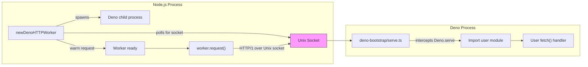
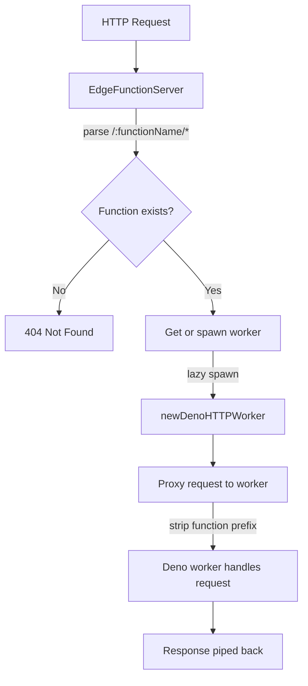

# @cobeo2004/edge

[](https://npmjs.org/package/@cobeo2004/edge)

Securely spawn Deno HTTP workers from Node.js, Bun, or Deno over Unix sockets.

> **Forked from [@valtown/deno-http-worker](https://github.com/val-town/deno-http-worker).**
> Full credit to [Val Town](https://val.town) for the original design and implementation.

## Architecture



### How communication works

All traffic between Node.js and Deno flows over a **Unix domain socket** using HTTP/1.1 with keep-alive. The bootstrap script rewrites requests using custom headers:

| Header                     | Purpose                                                             |
| -------------------------- | ------------------------------------------------------------------- |
| `X-Deno-Worker-URL`        | Carries the original request URL (since the socket has no hostname) |
| `X-Deno-Worker-Host`       | Preserves the original `Host` header                                |
| `X-Deno-Worker-Connection` | Preserves the original `Connection` header                          |

The Deno-side bootstrap (`deno-bootstrap/serve.ts`) intercepts `Deno.serve()` calls from user code, extracts the handler, and re-serves it on the Unix socket with header rewriting applied.

### EdgeFunctionServer flow



## Installation

**Prerequisites:** [Deno](https://deno.com) must be installed and available on `PATH`.

```bash
npm install @cobeo2004/edge
```

## Quick Start

```ts
import { newDenoHTTPWorker } from "@cobeo2004/edge";

const worker = await newDenoHTTPWorker(
  `export default {
    async fetch(req: Request): Promise<Response> {
      return Response.json({ ok: req.url });
    },
  }`,
  { printOutput: true, runFlags: ["--allow-net"] },
);

const body = await new Promise((resolve, reject) => {
  const req = worker.request("https://hello/world?query=param", {}, (resp) => {
    const body: Buffer[] = [];
    resp.on("error", reject);
    resp.on("data", (chunk) => body.push(chunk));
    resp.on("end", () => resolve(Buffer.concat(body).toString()));
  });
  req.end();
});

console.log(body); // => {"ok":"https://hello/world?query=param"}

worker.terminate();
```

You can also pass a `file://` or `https://` URL to load a module instead of inline code:

```ts
const worker = await newDenoHTTPWorker(new URL("file:///path/to/handler.ts"), {
  runFlags: ["--allow-net"],
});
```

## EdgeFunctionServer

`EdgeFunctionServer` is an HTTP server that routes requests to per-function Deno workers. Each subdirectory under `functionsDir` is a separate function, identified by its folder name.

```
functions/
├── hello/
│   └── index.ts
└── greet/
    └── index.ts
```

Each function must have an entrypoint file (`index.ts`, `index.tsx`, `index.js`, or `index.mjs`) that calls `Deno.serve()`.

```ts
import { newEdgeFunctionServer } from "@cobeo2004/edge";

const server = newEdgeFunctionServer({
  functionsDir: "/absolute/path/to/functions",
  port: 3000,
  eagerSpawn: true, // spawn all workers at startup
  hotReload: true, // watch for file changes & restart workers
  workerOptions: {
    runFlags: ["--allow-net", "--allow-env"],
  },
  onFunctionReady: (name) => console.log(`${name} is ready`),
  onFunctionError: (name, err) => console.error(`${name} error:`, err),
});

await server.start();

// Requests are routed by the first path segment:
// GET http://localhost:3000/hello/world  → hello function, path: /world
// GET http://localhost:3000/greet        → greet function, path: /

// Graceful shutdown
await server.stop();
```

## Multi-Runtime Server Adapters

`EdgeFunctionServer` uses a pluggable adapter system for the host-facing HTTP server. By default, it auto-detects the runtime and selects the appropriate adapter:

- **Node.js** — `node:http` with web standard `Request`/`Response` conversion
- **Bun** — native `Bun.serve()`
- **Deno** — native `Deno.serve()`

You can explicitly set the adapter:

```ts
const server = newEdgeFunctionServer({
  functionsDir: "/path/to/functions",
  port: 3000,
  adapter: "bun", // or "node", "deno"
});
```

Or provide a custom adapter implementing the `ServerAdapter` interface:

```ts
import type {
  ServerAdapter,
  AdapterServer,
  RequestHandler,
} from "@cobeo2004/edge";

const myAdapter: ServerAdapter = {
  createServer(handler: RequestHandler): AdapterServer {
    // Return an object with listen(), close(), and port
  },
};

const server = newEdgeFunctionServer({
  functionsDir: "/path/to/functions",
  port: 3000,
  adapter: myAdapter,
});
```

> **Note:** Only the host-facing HTTP server is adapted. Worker communication (`worker.request()`) always uses `node:http` over Unix sockets — all three runtimes support this via Node.js compatibility layers.

## Environment Variables & Secrets

`EdgeFunctionServer` automatically loads `.env` files and supports programmatic env var injection with secret masking in logs.

### `.env` file loading

Place `.env` files in your functions directory for automatic loading:

```
functions/
├── .env              ← global, applied to all workers
├── hello/
│   └── index.ts
└── greet/
    ├── .env          ← per-function, applied only to greet
    └── index.ts
```

### Precedence (lowest → highest)

1. `process.env` (host environment)
2. Global `.env` at `functionsDir/.env`
3. Additional `envFiles` (array order)
4. `EdgeFunctionServerOptions.env` (programmatic)
5. Per-function `.env` at `functionsDir/<name>/.env`
6. `workerOptions.env` (programmatic per-worker)

### Server-level env options

```ts
const server = newEdgeFunctionServer({
  functionsDir: "/path/to/functions",
  port: 3000,
  env: { API_KEY: "my-key" }, // applied to all workers
  envFiles: ["/path/to/extra.env"], // additional .env files
  maskSecrets: true, // mask env values in logs (default: true)
});
```

### Worker-level env option

```ts
const worker = await newDenoHTTPWorker(script, {
  runFlags: ["--allow-net", "--allow-env"],
  env: { MY_VAR: "value" }, // merged on top of process.env
});
```

### Secret masking

When `maskSecrets` is enabled (the default), environment variables whose keys contain `SECRET`, `KEY`, `TOKEN`, `PASSWORD`, `CREDENTIAL`, `AUTH`, or `PRIVATE` are automatically masked in log output by replacing their values with `***`. Values shorter than 3 characters are not masked. Disable with `maskSecrets: false`.

### Standalone utilities

The `.env` parser and secret masker are exported for direct use:

```ts
import { parseEnvFile, loadEnvFile, createSecretMasker } from "@cobeo2004/edge";

const vars = parseEnvFile('KEY="value"\n# comment\nFOO=bar');
// { KEY: "value", FOO: "bar" }

const vars2 = await loadEnvFile("/path/to/.env"); // {} on ENOENT

const mask = createSecretMasker(["my-secret-key"]);
mask("token is my-secret-key"); // "token is ***"
```

## Configuration

All options for `newDenoHTTPWorker` are partial (have defaults). Key options:

| Option                     | Type                               | Description                                                                              |
| -------------------------- | ---------------------------------- | ---------------------------------------------------------------------------------------- |
| `runFlags`                 | `string[]`                         | Deno permission flags (e.g. `["--allow-net"]`)                                           |
| `importMapPath`            | `string`                           | Path to an import map JSON file                                                          |
| `configPath`               | `string`                           | Path to a `deno.json` config file                                                        |
| `env`                      | `Record<string, string>`           | Environment variables merged on top of `process.env`                                     |
| `denoExecutable`           | `string \| string[]`               | Path to the Deno binary (default: `"deno"`)                                              |
| `logLevel`                 | `LogLevel`                         | Logging verbosity: `"debug"`, `"info"`, `"warn"`, `"error"`, `"silent"` (default)        |
| `onLog`                    | `(level, source, message) => void` | Custom log handler (default: `console.log`/`console.error` with `[deno]` prefix)         |
| `printOutput`              | `boolean`                          | Print Deno stdout/stderr with `[deno]` prefix (legacy, equivalent to `logLevel: "info"`) |
| `printCommandAndArguments` | `boolean`                          | Log the spawned command for debugging (legacy, equivalent to `logLevel: "debug"`)        |
| `spawnOptions`             | `SpawnOptions`                     | Options passed to `child_process.spawn`                                                  |
| `denoBootstrapScriptPath`  | `string`                           | Custom bootstrap script (advanced)                                                       |

`EdgeFunctionServerOptions` additionally supports:

| Option          | Type                                             | Description                                                                                     |
| --------------- | ------------------------------------------------ | ----------------------------------------------------------------------------------------------- |
| `functionsDir`  | `string`                                         | Absolute path to the functions directory                                                        |
| `port`          | `number`                                         | Port to listen on                                                                               |
| `hostname`      | `string`                                         | Hostname to bind to (default: `"127.0.0.1"`)                                                    |
| `adapter`       | `RuntimeName \| ServerAdapter`                   | Server adapter: `"node"`, `"bun"`, `"deno"`, or a custom `ServerAdapter` (default: auto-detect) |
| `eagerSpawn`    | `boolean`                                        | Spawn all workers at startup (default: `false`)                                                 |
| `hotReload`     | `boolean`                                        | Watch & restart on file changes (default: `false`)                                              |
| `workerOptions` | `Partial<DenoWorkerOptions>`                     | Options forwarded to each worker                                                                |
| `logLevel`      | `LogLevel`                                       | Log level for all function workers (default: `"silent"`)                                        |
| `onLog`         | `(functionName, level, source, message) => void` | Custom log handler with function name context (default: `[deno:${name}]` prefix)                |
| `env`           | `Record<string, string>`                         | Environment variables applied to all workers                                                    |
| `envFiles`      | `string[]`                                       | Additional `.env` file paths loaded at startup                                                  |
| `maskSecrets`   | `boolean`                                        | Mask env var values in log output (default: `true`)                                             |

## Logging

Control worker output verbosity with `logLevel` and optionally route logs through a custom `onLog` handler.

### Log levels

| Level      | What is logged                  |
| ---------- | ------------------------------- |
| `"debug"`  | Spawn command + stdout + stderr |
| `"info"`   | stdout + stderr                 |
| `"warn"`   | stderr only                     |
| `"error"`  | Only early-exit/crash output    |
| `"silent"` | Nothing (default)               |

### Custom log handler

```ts
const worker = await newDenoHTTPWorker(script, {
  logLevel: "info",
  onLog: (level, source, message) => {
    // level: "debug" | "info" | "warn" | "error"
    // source: "stdout" | "stderr" | "command"
    myLogger[level](`[worker:${source}] ${message}`);
  },
});
```

### EdgeFunctionServer logging

The server-level `onLog` callback includes the function name so you can distinguish output from different workers:

```ts
const server = newEdgeFunctionServer({
  functionsDir: "/path/to/functions",
  port: 3000,
  logLevel: "info",
  onLog: (functionName, level, source, message) => {
    console.log(`[${functionName}:${source}] ${message}`);
  },
});
```

### Backward compatibility

The legacy `printOutput` and `printCommandAndArguments` booleans still work. When `logLevel` is not set:

- `printOutput: true` resolves to `logLevel: "info"`
- `printCommandAndArguments: true` resolves to `logLevel: "debug"`

An explicit `logLevel` takes precedence over both booleans.

## Import Maps

You can pass an [import map](https://docs.deno.com/runtime/fundamentals/configuration/#an-import-map) to the worker with the `importMapPath` option. The import map file is automatically added to `--allow-read` permissions.

```json
{
  "imports": {
    "lodash/": "https://esm.sh/lodash-es/"
  }
}
```

```ts
const worker = await newDenoHTTPWorker(
  `import capitalize from "lodash/capitalize";
  export default {
    async fetch(req: Request): Promise<Response> {
      return Response.json({ message: capitalize("hello world") });
    },
  }`,
  {
    importMapPath: "./import_map.json",
    runFlags: ["--allow-net"],
  },
);
```

Alternatively, use `configPath` to point to a full `deno.json` which supports `imports`, `nodeModulesDir`, `compilerOptions`, and more.

## API Reference

### Exports

| Export                              | Kind     | Description                                                     |
| ----------------------------------- | -------- | --------------------------------------------------------------- |
| `newDenoHTTPWorker(code, options?)` | Function | Spawn a Deno worker from inline code or a URL                   |
| `newEdgeFunctionServer(options)`    | Function | Create an `EdgeFunctionServer` instance                         |
| `DenoHTTPWorker`                    | Type     | Worker instance with `request()`, `terminate()`, `shutdown()`   |
| `EdgeFunctionServer`                | Class    | HTTP server routing to per-function Deno workers                |
| `DenoWorkerOptions`                 | Type     | Options for `newDenoHTTPWorker`                                 |
| `EdgeFunctionServerOptions`         | Type     | Options for `EdgeFunctionServer`                                |
| `LogLevel`                          | Type     | `"debug" \| "info" \| "warn" \| "error" \| "silent"`            |
| `EarlyExitDenoHTTPWorkerError`      | Class    | Error thrown when the Deno process exits unexpectedly           |
| `MinimalChildProcess`               | Type     | Interface for the spawned child process                         |
| `ServerAdapter`                     | Type     | Adapter interface for pluggable HTTP servers                    |
| `AdapterServer`                     | Type     | Server instance returned by an adapter                          |
| `RequestHandler`                    | Type     | `(request: Request) => Promise<Response>`                       |
| `RuntimeName`                       | Type     | `"node" \| "bun" \| "deno"`                                     |
| `detectRuntime()`                   | Function | Detect current runtime (`"node"`, `"bun"`, or `"deno"`)         |
| `resolveAdapter(option?)`           | Function | Resolve a `ServerAdapter` from a runtime name or custom adapter |
| `nodeAdapter`                       | Object   | Built-in Node.js server adapter                                 |
| `parseEnvFile(content)`             | Function | Parse `.env` file content into a key-value record               |
| `loadEnvFile(path)`                 | Function | Load and parse a `.env` file (returns `{}` on ENOENT)           |
| `createSecretMasker(secrets)`       | Function | Create a function that masks secret values in strings           |

## License

MIT
