# @cobeo2004/edge

[](https://npmjs.org/package/@cobeo2004/edge)

Securely spawn Deno HTTP workers from Node.js, Bun, or Deno over Unix sockets.

> **Forked from [@valtown/deno-http-worker](https://github.com/val-town/deno-http-worker).**
> Full credit to [Val Town](https://val.town) for the original design and implementation.

## Table of Contents

- [Architecture](#architecture)
- [Installation](#installation)
- [Quick Start](#quick-start)
- [EdgeFunctionServer](#edgefunctionserver)
- [Multi-Runtime Server Adapters](#multi-runtime-server-adapters)
- [Environment Variables & Secrets](#environment-variables--secrets)
- [Authentication](#authentication)
- [Permission Profiles](#permission-profiles)
- [Execution Limits](#execution-limits)
- [Idle Timeout (Cold/Warm Lifecycle)](#idle-timeout-coldwarm-lifecycle)
- [Worker Pool & Concurrency](#worker-pool--concurrency)
- [WebSocket Support](#websocket-support)
- [Background Tasks](#background-tasks)
- [Configuration](#configuration)
- [Logging](#logging)
- [Shared Folders](#shared-folders)
- [Import Maps](#import-maps)
- [API Reference](#api-reference)
- [License](#license)

## Architecture

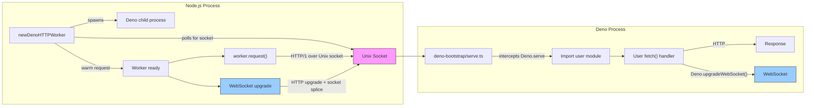

### How communication works

All traffic between Node.js and Deno flows over a **Unix domain socket** using HTTP/1.1 with keep-alive. The bootstrap script rewrites requests using custom headers:

| Header                     | Purpose                                                             |
| -------------------------- | ------------------------------------------------------------------- |
| `X-Deno-Worker-URL`        | Carries the original request URL (since the socket has no hostname) |
| `X-Deno-Worker-Host`       | Preserves the original `Host` header                                |
| `X-Deno-Worker-Connection` | Preserves the original `Connection` header                          |

The Deno-side bootstrap (`deno-bootstrap/serve.ts`) intercepts `Deno.serve()` calls from user code, extracts the handler, and re-serves it on the Unix socket with header rewriting applied.

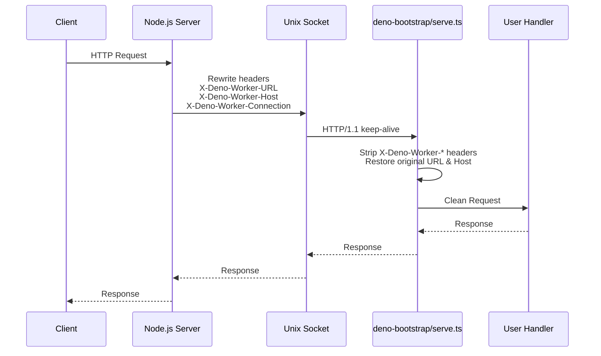

### EdgeFunctionServer flow

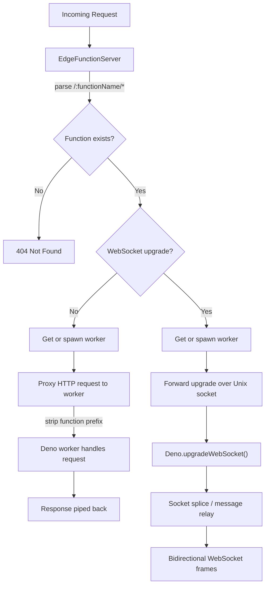

## Installation

**Prerequisites:** [Deno](https://deno.com) must be installed and available on `PATH`.

```bash
npm install @cobeo2004/edge
```

## Quick Start

```ts
import { newDenoHTTPWorker } from "@cobeo2004/edge";

const worker = await newDenoHTTPWorker(
  `export default {
    async fetch(req: Request): Promise<Response> {
      return Response.json({ ok: req.url });
    },
  }`,
  { printOutput: true, runFlags: ["--allow-net"] },
);

const body = await new Promise((resolve, reject) => {
  const req = worker.request("https://hello/world?query=param", {}, (resp) => {
    const body: Buffer[] = [];
    resp.on("error", reject);
    resp.on("data", (chunk) => body.push(chunk));
    resp.on("end", () => resolve(Buffer.concat(body).toString()));
  });
  req.end();
});

console.log(body); // => {"ok":"https://hello/world?query=param"}

worker.terminate();
```

You can also pass a `file://` or `https://` URL to load a module instead of inline code:

```ts
const worker = await newDenoHTTPWorker(new URL("file:///path/to/handler.ts"), {
  runFlags: ["--allow-net"],
});
```

## EdgeFunctionServer

`EdgeFunctionServer` is an HTTP server that routes requests to per-function Deno workers. Each subdirectory under `functionsDir` is a separate function, identified by its folder name. Directories starting with `_` are treated as [shared folders](#shared-folders) instead.

```
functions/
├── _shared/          ← shared code, not a function
│   └── utils.ts
├── hello/
│   └── index.ts
└── greet/
    └── index.ts
```

Each function must have an entrypoint file (`index.ts`, `index.tsx`, `index.js`, or `index.mjs`) that calls `Deno.serve()`.

```ts
import { newEdgeFunctionServer } from "@cobeo2004/edge";

const server = newEdgeFunctionServer({
  functionsDir: "/absolute/path/to/functions",
  port: 3000,
  eagerSpawn: true, // spawn all workers at startup
  hotReload: true, // watch for file changes & restart workers
  workerOptions: {
    runFlags: ["--allow-net", "--allow-env"],
  },
  onFunctionReady: (name) => console.log(`${name} is ready`),
  onFunctionError: (name, err) => console.error(`${name} error:`, err),
});

await server.start();

// Requests are routed by the first path segment:
// GET http://localhost:3000/hello/world  → hello function, path: /world
// GET http://localhost:3000/greet        → greet function, path: /

// Graceful shutdown
await server.stop();
```

## Multi-Runtime Server Adapters

`EdgeFunctionServer` uses a pluggable adapter system for the host-facing HTTP server. By default, it auto-detects the runtime and selects the appropriate adapter:

- **Node.js** — `node:http` with web standard `Request`/`Response` conversion
- **Bun** — native `Bun.serve()`
- **Deno** — native `Deno.serve()`

You can explicitly set the adapter:

```ts
const server = newEdgeFunctionServer({
  functionsDir: "/path/to/functions",
  port: 3000,
  adapter: "bun", // or "node", "deno"
});
```

Or provide a custom adapter implementing the `ServerAdapter` interface:

```ts
import type {
  ServerAdapter,
  AdapterServer,
  WorkerRequestHandler,
} from "@cobeo2004/edge";

const myAdapter: ServerAdapter = {
  createServer(handler: WorkerRequestHandler): AdapterServer {
    // Return an object with listen(), close(), and port
  },
};

const server = newEdgeFunctionServer({
  functionsDir: "/path/to/functions",
  port: 3000,
  adapter: myAdapter,
});
```

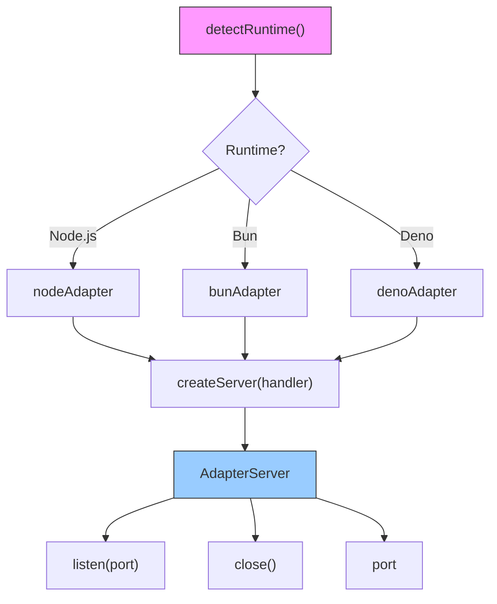

> **Note:** Only the host-facing HTTP server is adapted. Worker communication (`worker.request()`) always uses `node:http` over Unix sockets — all three runtimes support this via Node.js compatibility layers.

## Environment Variables & Secrets

`EdgeFunctionServer` automatically loads `.env` files and supports programmatic env var injection with secret masking in logs.

### `.env` file loading

Place `.env` files in your functions directory for automatic loading:

```
functions/
├── .env              ← global, applied to all workers
├── hello/
│   └── index.ts
└── greet/
    ├── .env          ← per-function, applied only to greet
    └── index.ts
```

### Precedence (lowest → highest)

1. `process.env` (host environment)
2. Global `.env` at `functionsDir/.env`
3. Additional `envFiles` (array order)
4. `EdgeFunctionServerOptions.env` (programmatic)
5. Per-function `.env` at `functionsDir/<name>/.env`
6. `workerOptions.env` (programmatic per-worker)

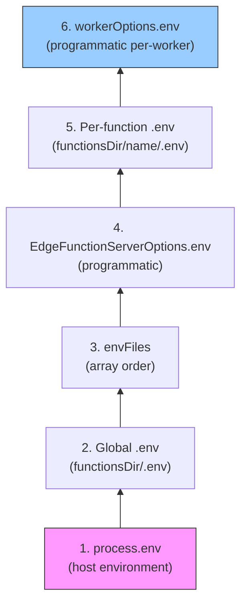

### Server-level env options

```ts
const server = newEdgeFunctionServer({
  functionsDir: "/path/to/functions",
  port: 3000,
  env: { API_KEY: "my-key" }, // applied to all workers
  envFiles: ["/path/to/extra.env"], // additional .env files
  maskSecrets: true, // mask env values in logs (default: true)
});
```

### Worker-level env option

```ts
const worker = await newDenoHTTPWorker(script, {
  runFlags: ["--allow-net", "--allow-env"],
  env: { MY_VAR: "value" }, // merged on top of process.env
});
```

### Secret masking

When `maskSecrets` is enabled (the default), environment variables whose keys contain `SECRET`, `KEY`, `TOKEN`, `PASSWORD`, `CREDENTIAL`, `AUTH`, or `PRIVATE` are automatically masked in log output by replacing their values with `***`. Values shorter than 3 characters are not masked. Disable with `maskSecrets: false`.

### Standalone utilities

The `.env` parser and secret masker are exported for direct use:

```ts
import { parseEnvFile, loadEnvFile, createSecretMasker } from "@cobeo2004/edge";

const vars = parseEnvFile('KEY="value"\n# comment\nFOO=bar');
// { KEY: "value", FOO: "bar" }

const vars2 = await loadEnvFile("/path/to/.env"); // {} on ENOENT

const mask = createSecretMasker(["my-secret-key"]);
mask("token is my-secret-key"); // "token is ***"
```

## Authentication

`EdgeFunctionServer` supports pluggable authentication via the `AuthStrategy` interface. Authentication is opt-in — when no `auth` option is set, all requests pass through as before.

### Built-in JWT Strategy

The library ships a `JWTStrategy` powered by [`jose`](https://github.com/panva/jose) with full algorithm support (HMAC, RSA, EC) and JWKS endpoint verification.

```ts
import { EdgeFunctionServer, JWTStrategy } from "@cobeo2004/edge";

const server = new EdgeFunctionServer({
  functionsDir: "/path/to/functions",
  port: 3000,
  auth: new JWTStrategy({
    secret: process.env.JWT_SECRET!, // HMAC shared secret
    issuer: "my-app", // validate iss claim (optional)
    audience: "api", // validate aud claim (optional)
  }),
});
```

`JWTStrategy` options:

| Option           | Type                              | Description                                                 |
| ---------------- | --------------------------------- | ----------------------------------------------------------- |
| `secret`         | `string`                          | HMAC shared secret                                          |
| `key`            | `CryptoKey \| Uint8Array`         | RSA/EC public key for direct verification                   |
| `jwksEndpoint`   | `string`                          | JWKS URL for remote key fetching                            |
| `algorithms`     | `string[]`                        | Accepted algorithms (default: inferred)                     |
| `issuer`         | `string`                          | Expected `iss` claim                                        |
| `audience`       | `string \| string[]`              | Expected `aud` claim                                        |
| `clockTolerance` | `number`                          | Clock tolerance in seconds (default: `0`)                   |
| `tokenLocation`  | `"header" \| "cookie" \| "query"` | Where to extract the token (default: `"header"`)            |
| `tokenKey`       | `string`                          | Header/cookie/query param name (default: `"authorization"`) |

JWKS example (for Auth0, Supabase, Firebase, etc.):

```ts
auth: new JWTStrategy({
  jwksEndpoint: "https://your-tenant.auth0.com/.well-known/jwks.json",
  audience: "https://api.example.com",
}),
```

### Custom auth strategy

Implement the `AuthStrategy` interface for any auth mechanism (API keys, OAuth introspection, etc.):

```ts
import type { AuthStrategy, AuthResult } from "@cobeo2004/edge";

const apiKeyAuth: AuthStrategy = {
  extractCredentials(request: Request) {
    return Promise.resolve(request.headers.get("x-api-key"));
  },
  verify(credentials: string) {
    if (credentials === process.env.API_KEY) {
      return Promise.resolve({ valid: true, claims: { role: "service" } });
    }
    return Promise.resolve({ valid: false, error: "Invalid API key" });
  },
};

const server = new EdgeFunctionServer({
  functionsDir: "/path/to/functions",
  port: 3000,
  auth: apiKeyAuth,
});
```

### Auth claims forwarding

When authentication succeeds, decoded claims are forwarded to the worker via the `X-Auth-Claims` header as a **base64url-encoded** JSON string. Inside your Deno function:

```ts
Deno.serve((req) => {
  const raw = req.headers.get("x-auth-claims") ?? "";
  const claims = raw ? JSON.parse(atob(raw)) : {};
  return Response.json({ user: claims.sub, role: claims.role });
});
```

> **Note:** The header is always stripped from incoming requests to prevent spoofing. It is only set by the server when authentication succeeds with claims.

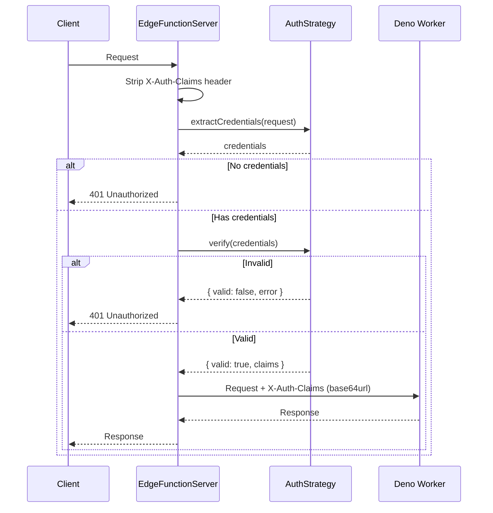

> **WebSocket support:** Authentication also applies to WebSocket upgrade requests. When auth is configured, the initial HTTP upgrade request must carry valid credentials (via headers, cookies, or query params depending on your `AuthStrategy`). Rejected upgrades receive a 401 response before the WebSocket handshake. Authenticated claims are forwarded via `X-Auth-Claims` on the upgrade request, accessible in `Deno.serve()` before calling `Deno.upgradeWebSocket()`.

### Public functions (auth opt-out)

Functions can skip authentication in two ways:

1. **Server-level:** list function names in `publicFunctions`:

```ts
const server = new EdgeFunctionServer({
  functionsDir: "/path/to/functions",
  port: 3000,
  auth: new JWTStrategy({ secret: "..." }),
  publicFunctions: ["health", "docs"],
});
```

2. **Per-function:** add a `function.json` in the function's directory:

```json
{ "auth": false }
```

### Custom auth failure response

Override the default 401 response with `onAuthFailure`:

```ts
const server = new EdgeFunctionServer({
  functionsDir: "/path/to/functions",
  port: 3000,
  auth: new JWTStrategy({ secret: "..." }),
  onAuthFailure: (request, result) =>
    new Response(JSON.stringify({ error: result.error }), {
      status: 403,
      headers: { "Content-Type": "application/json" },
    }),
});
```

## Permission Profiles

Control Deno permission flags per function using named profiles instead of manually specifying `runFlags`.

### Built-in profiles

| Profile      | Flags                     |
| ------------ | ------------------------- |
| `none`       | _(socket access only)_    |
| `strict`     | `--allow-net`             |
| `standard`   | `--allow-net --allow-env` |
| `permissive` | `--allow-all`             |

The default profile is `"standard"`. The factory automatically adds scoped `--allow-read` for socket, script, and import map paths, so `standard` does not include a blanket `--allow-read`.

### Server-level configuration

```ts
const server = new EdgeFunctionServer({
  functionsDir: "/path/to/functions",
  port: 3000,

  // Default profile for all functions
  defaultPermissionProfile: "strict",

  // Per-function overrides (takes priority over function.json)
  functionPermissions: {
    admin: "standard", // profile name
    compute: ["--allow-net"], // raw flags
  },

  // Custom named profiles
  permissionProfiles: {
    "read-only": ["--allow-net", "--allow-read"],
  },
});
```

### Per-function configuration (`function.json`)

Each function directory can contain a `function.json` that declares its permission profile, auth settings, idle timeout, WebSocket settings, and background task settings:

```
functions/
├── hello/
│   └── index.ts
├── admin/
│   ├── index.ts
│   └── function.json    ← { "permissions": "standard", "auth": true }
└── public-health/
    ├── index.ts
    └── function.json    ← { "permissions": "strict", "auth": false }
```

### Resolution order (highest priority wins)

1. `functionPermissions[name]` in server options
2. `permissions` in `function.json`
3. `defaultPermissionProfile` in server options
4. Falls back to `"standard"`

If `workerOptions.runFlags` is set explicitly, it takes absolute priority over all profiles.

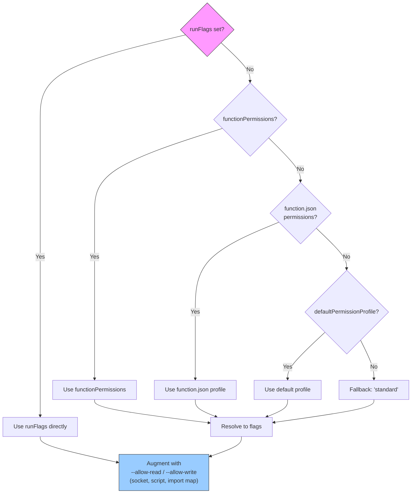

> **Note:** The factory's automatic `--allow-read` / `--allow-write` augmentation for socket files, import maps, and config files still applies on top of whatever the profile resolves to.

## Execution Limits

Prevent runaway functions from consuming unbounded resources with memory caps, request timeouts, and worker lifetime limits.

### Memory limit

Cap V8 heap memory per worker. When exceeded, the process is OOM-killed and respawns on the next request.

```ts
const worker = await newDenoHTTPWorker(script, {
  memoryLimitMb: 128, // 128 MB heap limit
  runFlags: ["--allow-net"],
});
```

### Per-request timeout

Abort individual requests that take too long without killing the worker. At the server level, timed-out requests return 504.

```ts
const server = newEdgeFunctionServer({
  functionsDir: "/path/to/functions",
  port: 3000,
  requestTimeout: 30_000, // 30 seconds
});
```

### Worker max duration

Limit the total wall-clock lifetime of a worker. After the duration expires, the worker is terminated and respawns on the next request.

```ts
const server = newEdgeFunctionServer({
  functionsDir: "/path/to/functions",
  port: 3000,
  workerMaxDuration: 600_000, // 10 minutes
});
```

### Request stats and worker stats

Track per-request timing and per-worker lifecycle metrics:

```ts
import type { RequestStats } from "@cobeo2004/edge";

const server = newEdgeFunctionServer({
  functionsDir: "/path/to/functions",
  port: 3000,
  requestTimeout: 5000,
  onRequestStats: (stats: RequestStats) => {
    console.log(
      `${stats.functionName}: ${stats.durationMs}ms (${stats.statusCode})`,
    );
    if (stats.timedOut) console.warn("Request timed out!");
  },
});

await server.start();

// After handling some requests:
const stats = server.getWorkerStats("hello");
// { totalRequests: 42, uptimeMs: 120000, restartCount: 1 }
```

### Health checks

Periodically ping workers to detect frozen or deadlocked processes. Unhealthy workers are terminated and immediately respawned.

```ts
const server = newEdgeFunctionServer({
  functionsDir: "/path/to/functions",
  port: 3000,
  healthCheckInterval: 10_000, // ping every 10 seconds
  healthCheckTimeout: 5_000, // 5 second timeout per ping
  healthCheckMaxFailures: 3, // restart after 3 consecutive failures
  onWorkerUnhealthy: (name, failures) => {
    console.warn(
      `Worker ${name} restarted after ${failures} failed health checks`,
    );
  },
});
```

Health checks are opt-in — they only run when `healthCheckInterval` is set. Options can be set at both the server level and per-worker level (via `workerOptions`), with per-worker values taking precedence.

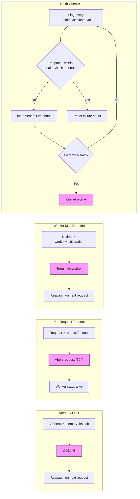

## Idle Timeout (Cold/Warm Lifecycle)

Workers can automatically transition between **warm** (running) and **cold** (terminated) states based on activity, mimicking Supabase Edge Functions behavior:

- **Cold start:** When a request arrives and no worker is running, one is spawned on demand.
- **Warm:** The worker stays alive while handling requests.
- **Idle → Cold:** After a configurable period with no in-flight requests, the worker is terminated to free resources. The next request triggers a new cold start.

```ts
const server = newEdgeFunctionServer({
  functionsDir: "/path/to/functions",
  port: 3000,
  idleTimeout: 30_000, // terminate workers after 30 seconds of inactivity
  onFunctionReady: (name) => console.log(`${name} is warm`),
  onFunctionCold: (name) => console.log(`${name} went cold`),
});
```

Idle timeout is **disabled by default** — workers stay alive indefinitely unless configured. This preserves backward compatibility.

### Per-function override

Override the server-level timeout for individual functions via `function.json`:

```json
{ "idleTimeout": 60000 }
```

A function with `"idleTimeout": 60000` stays warm for 60 seconds even if the server default is 30 seconds.

### How it works

- The idle timer only starts when all in-flight requests for a function complete (active request count drops to zero).
- Each new request clears and resets the timer.
- `idleTimeout` and `workerMaxDuration` are independent — both timers run, whichever fires first terminates the worker.
- Health check pings do not count as requests and do not reset the idle timer.
- When `eagerSpawn` is enabled, eagerly spawned workers will go cold if no requests arrive within the idle timeout.

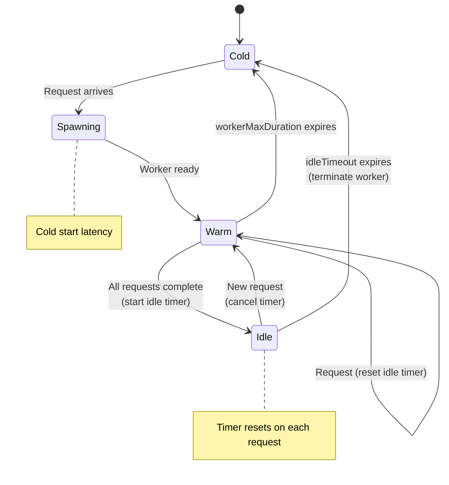

## Worker Pool & Concurrency

Run multiple worker instances per function to handle concurrent requests. Workers are managed by a `WorkerLifecycleManager` that handles spawning, load balancing, idle scale-down, health checks, and cold/warm transitions.

### Basic configuration

```ts
const server = newEdgeFunctionServer({
  functionsDir: "/path/to/functions",
  port: 3000,
  minWorkers: 1, // minimum instances per function (default: 0)
  maxWorkers: 4, // maximum instances per function (default: 1)
  idleTimeout: 30_000, // scale down idle workers after 30s
});
```

When `maxWorkers` is 1 (the default), behavior is identical to pre-concurrency versions — a single worker per function.

### How scaling works

- **Scale up:** When a request arrives and all existing workers are busy, a new worker is spawned (up to `maxWorkers`). Requests are routed to the least-loaded instance.
- **Scale down:** Idle workers are terminated after `idleTimeout` ms, but never below `minWorkers`. When the last instance is removed, `onFunctionCold` fires.
- **At capacity:** When all `maxWorkers` instances are busy and no spawn slots are available, requests are routed to the least-loaded worker (overload).

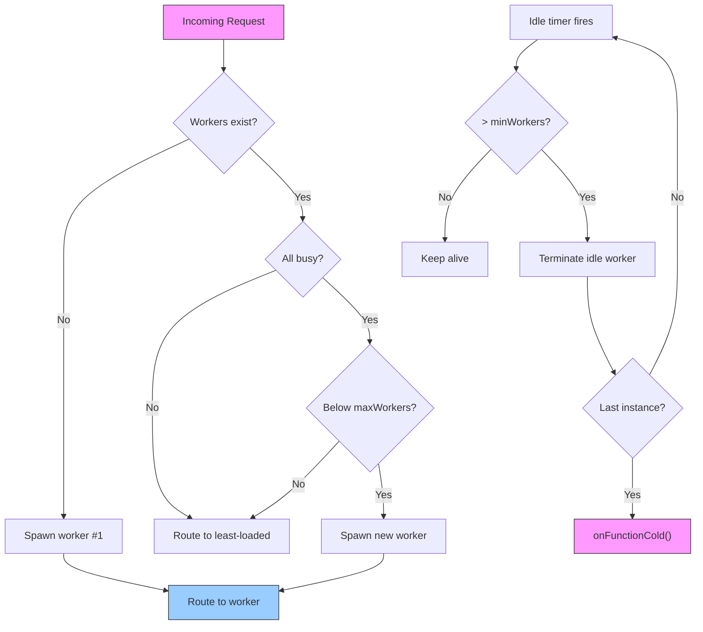

### Per-function overrides

Override pool and WebSocket settings per function via `function.json`:

```json
{ "minWorkers": 2, "maxWorkers": 8, "eagerSpawn": true, "maxWebSocketConnections": 50, "websocketKeepsAlive": false }
```

Per-function values take priority over server-level defaults.

### Eager spawning

Pre-warm workers at startup instead of waiting for the first request:

```ts
const server = newEdgeFunctionServer({
  functionsDir: "/path/to/functions",
  port: 3000,
  eagerSpawn: true, // spawn max(minWorkers, 1) instances at startup
  minWorkers: 2,
  maxWorkers: 4,
});
```

Per-function `eagerSpawn` in `function.json` overrides the server-level setting.

### Lifecycle callbacks

```ts
const server = newEdgeFunctionServer({
  functionsDir: "/path/to/functions",
  port: 3000,
  maxWorkers: 4,
  onFunctionReady: (name) => console.log(`${name} has at least one worker`),
  onFunctionCold: (name) => console.log(`${name} has zero workers`),
  onWorkerUnhealthy: (name, failures) =>
    console.warn(`${name} restarted after ${failures} health check failures`),
});
```

## WebSocket Support

Edge functions can serve WebSocket connections. The server transparently proxies WebSocket upgrades through to Deno workers over Unix sockets.

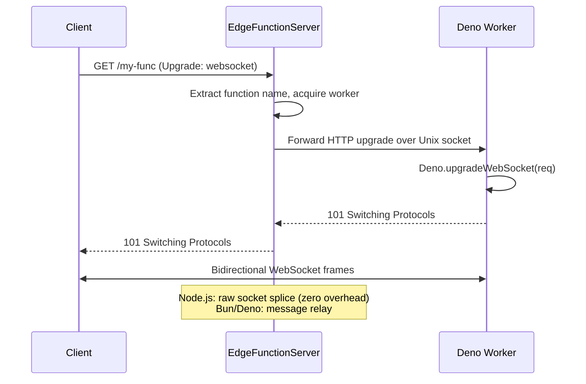

### Deno function code

Functions use the standard `Deno.upgradeWebSocket()` API — no special libraries needed:

```ts
// functions/chat/index.ts
Deno.serve((req) => {
  if (req.headers.get("upgrade") !== "websocket") {
    return new Response("Expected WebSocket", { status: 426 });
  }
  const { socket, response } = Deno.upgradeWebSocket(req);
  socket.onopen = () => console.log("Client connected");
  socket.onmessage = (e) => socket.send(`echo: ${e.data}`);
  socket.onclose = () => console.log("Client disconnected");
  return response;
});
```

### Client code

Any standard WebSocket client works — the client connects to the server, not directly to Deno:

```ts
// Browser, Node.js, Bun, Deno, Python, Go — any WebSocket client
const ws = new WebSocket("ws://localhost:3000/chat");
ws.onopen = () => ws.send("hello");
ws.onmessage = (e) => console.log(e.data); // "echo: hello"
```

### Server configuration

```ts
const server = newEdgeFunctionServer({
  functionsDir: "/path/to/functions",
  port: 3000,
  maxWebSocketConnections: 100, // per worker instance (default: 100)
  globalMaxWebSocketConnections: 500, // server-wide cap across all functions/workers (optional)
  websocketKeepsAlive: true, // WS connections prevent idle timeout (default: true)
  onWebSocketConnect: (functionName, connectionId) => {
    console.log(`WS connected: ${functionName} (${connectionId})`);
  },
  onWebSocketClose: (functionName, connectionId, code, reason) => {
    console.log(`WS closed: ${functionName} (${code}: ${reason})`);
  },
  onWebSocketError: (functionName, connectionId, error) => {
    console.error(`WS error: ${functionName}`, error);
  },
});
```

### Per-function configuration

Override WebSocket settings per function via `function.json`:

```json
{
  "maxWebSocketConnections": 50,
  "websocketKeepsAlive": false
}
```

| Field | Type | Description |
|---|---|---|
| `maxWebSocketConnections` | `number` | Max connections per worker instance for this function (default: server-level value or `100`) |
| `websocketKeepsAlive` | `boolean` | Whether active connections prevent idle timeout for this function (default: server-level value or `true`) |

Per-function values take priority over server-level defaults. The `globalMaxWebSocketConnections` server-wide cap is always enforced on top of per-function limits.

### Authentication

WebSocket upgrades go through the same authentication flow as HTTP requests. When `auth` is configured, the client must include credentials in the upgrade request:

```ts
// Server
const server = new EdgeFunctionServer({
  functionsDir: "/path/to/functions",
  port: 3000,
  auth: new JWTStrategy({ secret: process.env.JWT_SECRET! }),
  publicFunctions: ["health"], // these skip auth for both HTTP and WebSocket
});
```

Inside the Deno function, read claims from the upgrade request:

```ts
Deno.serve((req) => {
  const raw = req.headers.get("x-auth-claims") ?? "";
  const b64 = raw.replace(/-/g, "+").replace(/_/g, "/");
  const claims = raw ? JSON.parse(atob(b64)) : {};
  const { socket, response } = Deno.upgradeWebSocket(req);
  socket.onopen = () => console.log(`User ${claims.sub} connected`);
  socket.onmessage = (e) => socket.send(`${claims.sub}: ${e.data}`);
  return response;
});
```

### How it works

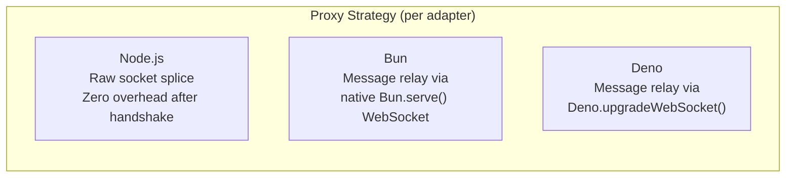

- **Node.js adapter:** Intercepts the `'upgrade'` event on `http.Server`, forwards the raw HTTP upgrade to the worker's Unix socket, then pipes the two sockets together. After the handshake, it's a zero-copy byte pipe.
- **Bun adapter:** `Bun.serve()` terminates WebSocket on the host side. Messages are relayed bidirectionally to the worker over the Unix socket.
- **Deno adapter:** `Deno.upgradeWebSocket()` terminates WebSocket on the host side. Same relay approach as Bun.

### Integration with worker pool

- New WebSocket upgrades route to the **least-loaded** worker instance (based on HTTP active requests).
- When `websocketKeepsAlive` is `true` (default), the **idle timeout** is paused while WebSocket connections are active on a worker. Note: `websocketKeepsAlive` only affects idle timeout — it does not affect `workerMaxDuration`, which is enforced inside the Deno worker process independently of WebSocket state.
- When `websocketKeepsAlive` is `false`, workers can be terminated via idle timeout even with active connections — clients receive a close frame with code 1001 (Going Away).
- Workers at `maxWebSocketConnections` are skipped during routing; new instances are spawned up to `maxWorkers`.

### Graceful shutdown

When `server.stop()` is called, tracked WebSocket connections are cleaned up and workers are terminated. In raw splice mode (Node.js), both client and worker sockets are destroyed. In relay mode (Bun/Deno), host-side WebSockets are closed with code 1001 (Going Away).

## Background Tasks

Edge functions can run background work that outlives the HTTP response using `EdgeRuntime.waitUntil()` — compatible with Supabase Edge Functions.

### Deno function code

Use the global `EdgeRuntime.waitUntil()` to register promises that should complete after the response is sent:

```ts
// functions/analytics/index.ts
Deno.serve(async (req) => {
  const data = await req.json();

  // Fire-and-forget: response returns immediately,
  // background task continues running
  EdgeRuntime.waitUntil(
    fetch("https://analytics.example.com/events", {
      method: "POST",
      body: JSON.stringify(data),
    })
  );

  return new Response("accepted", { status: 202 });
});
```

Multiple `waitUntil()` calls are supported — each adds to the set of tracked promises. Rejected promises are logged to stderr but do not crash the worker.

### Server configuration

```ts
const server = new EdgeFunctionServer({
  functionsDir: "./functions",
  port: 3000,
  // Time allowed for background tasks after response (default: 30s)
  backgroundTaskTimeout: 30_000,
  // Pending background tasks prevent idle timeout (default: true)
  backgroundTaskKeepsAlive: true,
});
```

### Per-function overrides

Override background task settings per function via `function.json`:

```json
{
  "backgroundTaskTimeout": 60000,
  "backgroundTaskKeepsAlive": true
}
```

### How it works

1. The bootstrap layer exposes `EdgeRuntime.waitUntil(promise)` as a global before user code runs.
2. When a promise is registered, the bootstrap sends a structured message to the host via stderr.
3. The host tracks pending background tasks per worker instance.
4. The idle timeout timer is paused while background tasks are pending (when `backgroundTaskKeepsAlive` is `true`).
5. If background tasks exceed `backgroundTaskTimeout` after the last response, the worker is terminated.

### Timeout behavior

The background task timeout starts when `activeRequests` drops to 0 while background tasks are still pending. If a new request arrives, the timer resets. When the timeout fires, the worker is terminated (consistent with `workerMaxDuration` behavior) and the lifecycle manager respawns if below `minWorkers`.

### Graceful shutdown

When `server.stop()` is called, the server waits for pending background tasks to drain (up to `backgroundTaskTimeout`) before terminating workers. This ensures in-flight background work completes during normal shutdown.

## Configuration

All options for `newDenoHTTPWorker` are partial (have defaults). Key options:

| Option                     | Type                               | Description                                                                              |
| -------------------------- | ---------------------------------- | ---------------------------------------------------------------------------------------- |
| `runFlags`                 | `string[]`                         | Deno permission flags (e.g. `["--allow-net"]`)                                           |
| `importMapPath`            | `string`                           | Path to an import map JSON file                                                          |
| `configPath`               | `string`                           | Path to a `deno.json` config file                                                        |
| `env`                      | `Record<string, string>`           | Environment variables merged on top of `process.env`                                     |
| `memoryLimitMb`            | `number`                           | V8 heap memory limit in MB (process crashes and respawns on OOM)                         |
| `requestTimeout`           | `number`                           | Per-request timeout in ms (aborts request, worker stays alive)                           |
| `workerMaxDuration`        | `number`                           | Max wall-clock lifetime in ms (worker terminates, respawns on next request)              |
| `denoExecutable`           | `string \| string[]`               | Path to the Deno binary (default: `"deno"`)                                              |
| `logLevel`                 | `LogLevel`                         | Logging verbosity: `"debug"`, `"info"`, `"warn"`, `"error"`, `"silent"` (default)        |
| `onLog`                    | `(level, source, message) => void` | Custom log handler (default: `console.log`/`console.error` with `[deno]` prefix)         |
| `printOutput`              | `boolean`                          | Print Deno stdout/stderr with `[deno]` prefix (legacy, equivalent to `logLevel: "info"`) |
| `printCommandAndArguments` | `boolean`                          | Log the spawned command for debugging (legacy, equivalent to `logLevel: "debug"`)        |
| `spawnOptions`             | `SpawnOptions`                     | Options passed to `child_process.spawn`                                                  |
| `denoBootstrapScriptPath`  | `string`                           | Custom bootstrap script (advanced)                                                       |
| `healthCheckInterval`      | `number`                           | Interval in ms between health-check pings (disabled when not set)                        |
| `healthCheckTimeout`       | `number`                           | Timeout in ms for each health-check ping (default: `5000`)                               |
| `healthCheckMaxFailures`   | `number`                           | Consecutive failures before auto-restart (default: `3`)                                  |

`EdgeFunctionServerOptions` additionally supports:

| Option                     | Type                                                  | Description                                                                                     |
| -------------------------- | ----------------------------------------------------- | ----------------------------------------------------------------------------------------------- |
| `functionsDir`             | `string`                                              | Absolute path to the functions directory                                                        |
| `port`                     | `number`                                              | Port to listen on                                                                               |
| `hostname`                 | `string`                                              | Hostname to bind to (default: `"127.0.0.1"`)                                                    |
| `adapter`                  | `RuntimeName \| ServerAdapter`                        | Server adapter: `"node"`, `"bun"`, `"deno"`, or a custom `ServerAdapter` (default: auto-detect) |
| `eagerSpawn`               | `boolean`                                             | Spawn all workers at startup (default: `false`)                                                 |
| `hotReload`                | `boolean`                                             | Watch & restart on file changes (default: `false`)                                              |
| `watchSharedFolders`       | `boolean`                                             | Watch shared folders and restart all workers on change (default: `true`, requires `hotReload`)  |
| `workerOptions`            | `Partial<DenoWorkerOptions>`                          | Options forwarded to each worker                                                                |
| `memoryLimitMb`            | `number`                                              | V8 heap memory limit in MB for all workers                                                      |
| `requestTimeout`           | `number`                                              | Per-request timeout in ms; returns 504 on timeout                                               |
| `workerMaxDuration`        | `number`                                              | Max wall-clock lifetime in ms for each worker                                                   |
| `onRequestStats`           | `(stats: RequestStats) => void`                       | Callback fired after each request with timing and status info                                   |
| `logLevel`                 | `LogLevel`                                            | Log level for all function workers (default: `"silent"`)                                        |
| `onLog`                    | `(functionName, level, source, message) => void`      | Custom log handler with function name context (default: `[deno:${name}]` prefix)                |
| `env`                      | `Record<string, string>`                              | Environment variables applied to all workers                                                    |
| `envFiles`                 | `string[]`                                            | Additional `.env` file paths loaded at startup                                                  |
| `maskSecrets`              | `boolean`                                             | Mask env var values in log output (default: `true`)                                             |
| `healthCheckInterval`      | `number`                                              | Interval in ms between health-check pings (disabled when not set)                               |
| `healthCheckTimeout`       | `number`                                              | Timeout in ms for each health-check ping (default: `5000`)                                      |
| `healthCheckMaxFailures`   | `number`                                              | Consecutive failures before auto-restart (default: `3`)                                         |
| `onWorkerUnhealthy`        | `(name: string, consecutiveFailures: number) => void` | Called when a worker is restarted due to failed health checks                                   |
| `minWorkers`               | `number`                                              | Minimum worker instances per function (default: `0`)                                            |
| `maxWorkers`               | `number`                                              | Maximum worker instances per function (default: `1`)                                            |
| `idleTimeout`              | `number`                                              | Idle timeout in ms; worker terminates when idle (disabled by default)                           |
| `onFunctionCold`           | `(name: string) => void`                              | Called when last worker instance is terminated (zero workers remaining)                          |
| `auth`                     | `AuthStrategy`                                        | Pluggable auth strategy (opt-in, disabled by default)                                           |
| `onAuthFailure`            | `(request, error) => Response`                        | Custom response on auth failure (default: 401 JSON)                                             |
| `publicFunctions`          | `string[]`                                            | Functions that skip auth entirely                                                               |
| `defaultPermissionProfile` | `string`                                              | Default permission profile for all functions (default: `"standard"`)                            |
| `functionPermissions`      | `Record<string, string \| string[]>`                  | Per-function permission overrides (priority over function.json)                                 |
| `permissionProfiles`       | `Record<string, string[]>`                            | Custom named permission profiles (merged with built-ins)                                        |
| `maxWebSocketConnections`  | `number`                                              | Max WebSocket connections per worker instance (default: `100`). Overridable per function via `function.json`. |
| `globalMaxWebSocketConnections` | `number`                                         | Server-wide cap on total WebSocket connections across all functions/workers. When not set, no global cap is enforced. |
| `websocketKeepsAlive`      | `boolean`                                             | Active WebSocket connections prevent idle timeout; does not affect `workerMaxDuration` (default: `true`). Overridable per function via `function.json`. |
| `onWebSocketConnect`       | `(functionName: string, connectionId: string) => void` | Called when a WebSocket connection is established                                              |
| `onWebSocketClose`         | `(functionName: string, connectionId: string, code: number, reason: string) => void` | Called when a WebSocket connection is closed                    |
| `onWebSocketError`         | `(functionName: string, connectionId: string, error: Error) => void` | Called when a WebSocket connection errors                                        |
| `backgroundTaskTimeout`    | `number`                                                             | Max time (ms) to wait for background tasks after last response (default: `30000`). Overridable per function via `function.json`. |
| `backgroundTaskKeepsAlive` | `boolean`                                                            | Pending background tasks prevent idle timeout (default: `true`). Overridable per function via `function.json`. |

## Logging

Control worker output verbosity with `logLevel` and optionally route logs through a custom `onLog` handler.

### Log levels

| Level      | What is logged                  |
| ---------- | ------------------------------- |
| `"debug"`  | Spawn command + stdout + stderr |
| `"info"`   | stdout + stderr                 |
| `"warn"`   | stderr only                     |
| `"error"`  | Only early-exit/crash output    |
| `"silent"` | Nothing (default)               |

### Custom log handler

```ts
const worker = await newDenoHTTPWorker(script, {
  logLevel: "info",
  onLog: (level, source, message) => {
    // level: "debug" | "info" | "warn" | "error"
    // source: "stdout" | "stderr" | "command"
    myLogger[level](`[worker:${source}] ${message}`);
  },
});
```

### EdgeFunctionServer logging

The server-level `onLog` callback includes the function name so you can distinguish output from different workers:

```ts
const server = newEdgeFunctionServer({
  functionsDir: "/path/to/functions",
  port: 3000,
  logLevel: "info",
  onLog: (functionName, level, source, message) => {
    console.log(`[${functionName}:${source}] ${message}`);
  },
});
```

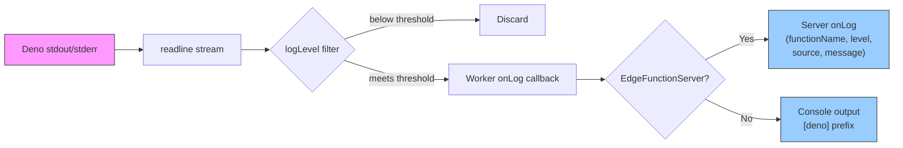

### Backward compatibility

The legacy `printOutput` and `printCommandAndArguments` booleans still work. When `logLevel` is not set:

- `printOutput: true` resolves to `logLevel: "info"`
- `printCommandAndArguments: true` resolves to `logLevel: "debug"`

An explicit `logLevel` takes precedence over both booleans.

## Shared Folders

Share code across edge functions using underscore-prefixed folders, following [Supabase's convention](https://supabase.com/docs/guides/functions/development-tips).

### Directory structure

Any folder starting with `_` is treated as a shared folder — it is excluded from function discovery and made available for imports.

```
functions/
├── _shared/
│   ├── cors.ts
│   └── db/
│       └── client.ts
├── _helpers/
│   └── utils.ts
├── hello/
│   └── index.ts
└── greet/
    └── index.ts
```

### Importing shared code

Functions can import shared modules two ways:

```ts
// Bare specifier (via auto-generated import map)
import { corsHeaders } from "_shared/cors.ts";
import { getClient } from "_shared/db/client.ts";

// Relative path (always works in Deno)
import { corsHeaders } from "../_shared/cors.ts";
```

The server automatically generates an import map with entries for all files in shared folders (`.ts`, `.tsx`, `.js`, `.jsx`, `.mjs`, `.json`), scanned recursively. If you also provide an `importMapPath`, the entries are merged — your import map takes precedence on conflicts.

### Read permissions

Shared folder paths are automatically added to `--allow-read` permissions for each worker, so Deno can access the shared files without granting read access to the entire functions directory.

### Hot-reload

When `hotReload` is enabled, changes to shared files trigger a restart of **all** running workers (since any function may depend on the changed file). This is controlled by the `watchSharedFolders` option:

```ts
const server = newEdgeFunctionServer({
  functionsDir: "/path/to/functions",
  port: 3000,
  hotReload: true,
  watchSharedFolders: true, // default: true (only effective when hotReload is true)
});
```

Set `watchSharedFolders: false` to disable shared folder watching while keeping function-level hot-reload active.

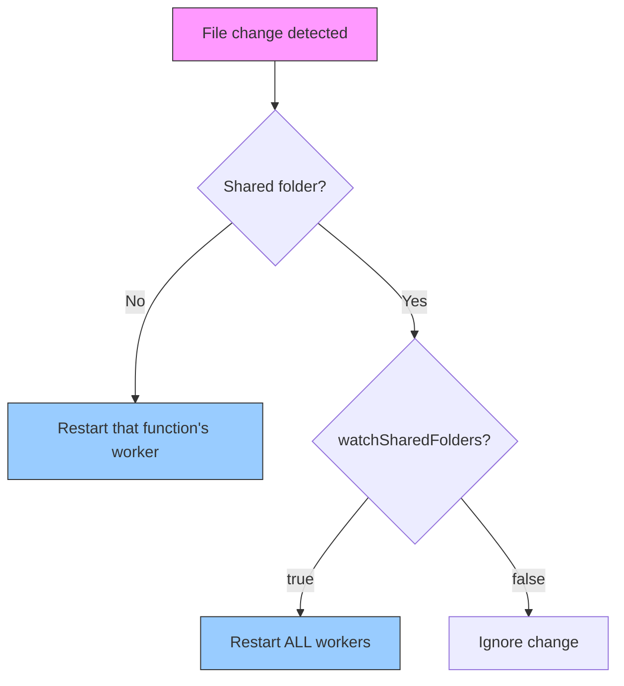

## Import Maps

You can pass an [import map](https://docs.deno.com/runtime/fundamentals/configuration/#an-import-map) to the worker with the `importMapPath` option. The import map file is automatically added to `--allow-read` permissions.

```json
{
  "imports": {
    "lodash/": "https://esm.sh/lodash-es/"
  }
}
```

```ts
const worker = await newDenoHTTPWorker(
  `import capitalize from "lodash/capitalize";
  export default {
    async fetch(req: Request): Promise<Response> {
      return Response.json({ message: capitalize("hello world") });
    },
  }`,
  {
    importMapPath: "./import_map.json",
    runFlags: ["--allow-net"],
  },
);
```

Alternatively, use `configPath` to point to a full `deno.json` which supports `imports`, `nodeModulesDir`, `compilerOptions`, and more.

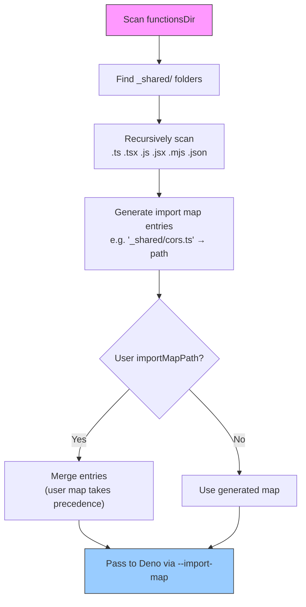

## API Reference

### Exports

| Export                                | Kind     | Description                                                               |
| ------------------------------------- | -------- | ------------------------------------------------------------------------- |
| `newDenoHTTPWorker(code, options?)`   | Function | Spawn a Deno worker from inline code or a URL                             |
| `newEdgeFunctionServer(options)`      | Function | Create an `EdgeFunctionServer` instance                                   |
| `DenoHTTPWorker`                      | Type     | Worker instance with `request()`, `terminate()`, `shutdown()`             |
| `EdgeFunctionServer`                  | Class    | HTTP server routing to per-function Deno workers                          |
| `DenoWorkerOptions`                   | Type     | Options for `newDenoHTTPWorker`                                           |
| `EdgeFunctionServerOptions`           | Type     | Options for `EdgeFunctionServer`                                          |
| `LogLevel`                            | Type     | `"debug" \| "info" \| "warn" \| "error" \| "silent"`                      |
| `EarlyExitDenoHTTPWorkerError`        | Class    | Error thrown when the Deno process exits unexpectedly                     |
| `MinimalChildProcess`                 | Type     | Interface for the spawned child process                                   |
| `RequestStats`                        | Type     | Per-request stats: timing, status code, timeout flag                      |
| `ServerAdapter`                       | Type     | Adapter interface for pluggable HTTP servers                              |
| `AdapterServer`                       | Type     | Server instance returned by an adapter                                    |
| `WorkerRequestHandler`                | Class    | Middleware for routing requests to per-function Deno workers              |
| `WorkerRequestHandlerOptions`         | Type     | Options for `WorkerRequestHandler`                                        |
| `RuntimeName`                         | Type     | `"node" \| "bun" \| "deno"`                                               |
| `detectRuntime()`                     | Function | Detect current runtime (`"node"`, `"bun"`, or `"deno"`)                   |
| `resolveAdapter(option?)`             | Function | Resolve a `ServerAdapter` from a runtime name or custom adapter           |
| `nodeAdapter`                         | Object   | Built-in Node.js server adapter                                           |
| `parseEnvFile(content)`               | Function | Parse `.env` file content into a key-value record                         |
| `loadEnvFile(path)`                   | Function | Load and parse a `.env` file (returns `{}` on ENOENT)                     |
| `createSecretMasker(secrets)`         | Function | Create a function that masks secret values in strings                     |
| `AuthStrategy`                        | Type     | Pluggable authentication strategy interface                               |
| `AuthResult`                          | Type     | Authentication verification result                                        |
| `JWTStrategy`                         | Class    | Built-in JWT auth strategy (HMAC, RSA, EC, JWKS)                          |
| `JWTStrategyOptions`                  | Type     | Options for `JWTStrategy`                                                 |
| `FunctionConfig`                      | Type     | Per-function configuration from `function.json`                           |
| `BUILT_IN_PROFILES`                   | Object   | Built-in permission profiles (`none`, `strict`, `standard`, `permissive`) |
| `resolvePermissionFlags(value, opts)` | Function | Resolve a profile name or flags array to Deno run flags                   |
| `WebSocketProxyHandler`               | Class    | WebSocket proxy with connection tracking, splice/relay modes              |
| `WebSocketConnection`                 | Type     | Tracked WebSocket connection metadata                                     |
| `HostWebSocket`                       | Type     | Runtime-agnostic WebSocket interface for Bun/Deno relay mode              |
| `WebSocketHooks`                      | Type     | Lifecycle hook callbacks (`onWebSocketConnect`, `Close`, `Error`)         |
| `WebSocketConfig`                     | Type     | WebSocket-specific config options                                         |
| `WebSocketUpgradeHandler`             | Type     | Union type for adapter upgrade handlers (splice or relay)                 |

## License

MIT
